# Klasse1 Laptop als Instrument

## Dateneingänge

- Trackpad
- Tastatur
- Videokamera (iSight)
- Mikrofon

# Track Pad

## mousestate

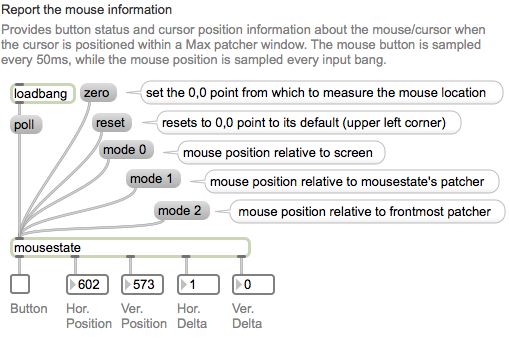

### Beispielpatch1

- X = Frequenz
- Y = Grenzfrequenz eines Filters

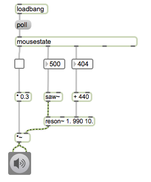

### Beispielpatch2

- Trackpad-Bewegung stuert die Lautstärke

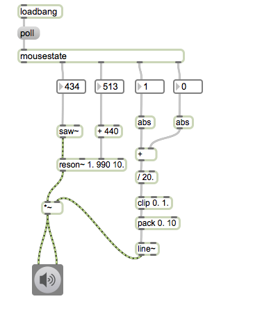

### Beispielpatch3 (Aufgabe)

- Scratching

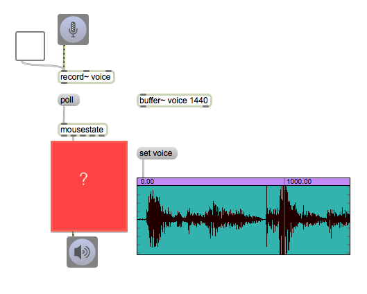

## Multitouch

[Fingerpinger](http://www.anyma.ch/2009/research/multitouch-external-for-maxmsp/)
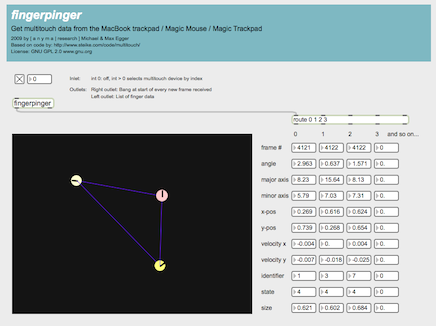

### Beispielpatch4

- Winkel des Fingers stuert Panning

### Beispielpatch5

- After-Touch Effekt
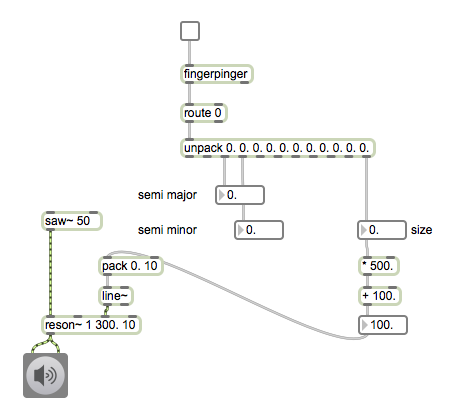

- Was sind semi-major-axis und semi-minor-axis
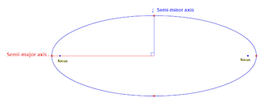

### Beispielpatch6 (Aufgabe)

- Distanz zwischen zwei Fingern stuert Grenzfrequenz
- 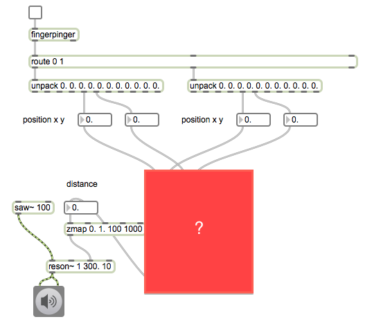

### Beispielpatch7

- Winkel zwichen zwei Punkten stuert Frequenz
- 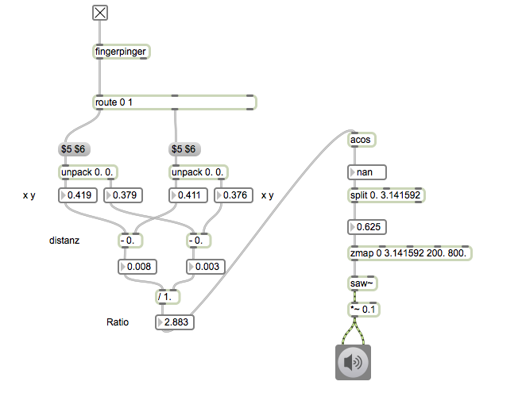

### Beispielpatch8 (Aufgabe)

- Flächeinhalt eines Dreiecks steurt die Lautstärke
- 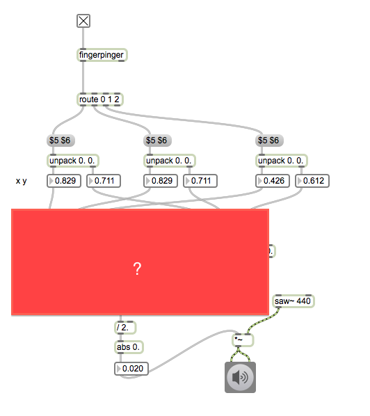

# Tastatur

-

### Beispielpatch1
-

### Beispielpatch2
-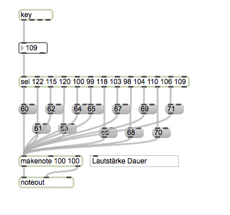

### Beispielpatch3
-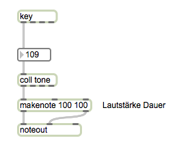

### Beispielpatch4

- Sequencer
-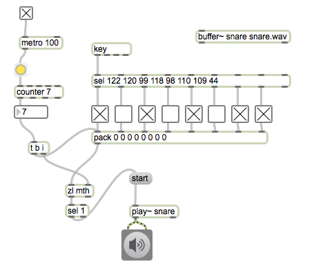

### Virtuoso Musiker mit Tastatur

- [Samchillian](http://en.wikipedia.org/wiki/Samchillian)
- [Demo](http://www.youtube.com/watch?v=lAAhQMU2918)

### Beispielpatch5 (Aufgabe)

- Programm Samchillian

# Videokamera

### Beispielpatch1

### Beispielpatch2

### Beispielpatch3

### Beispielpatch4

# Mikrofon

### Beispielpatch1

### Beispielpatch2

### Beispielpatch3

### Beispielpatch4

### Beispielpatch5

## Stanford Laptop Orchestra

[Website](http://slork.stanford.edu)