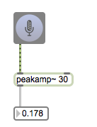
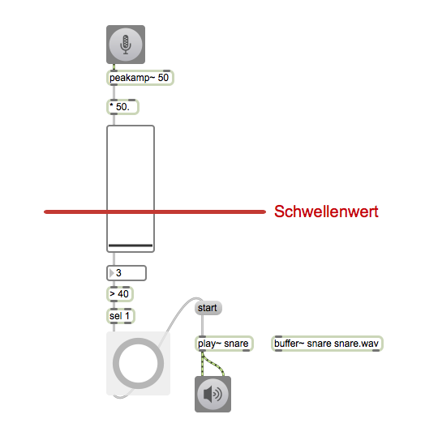
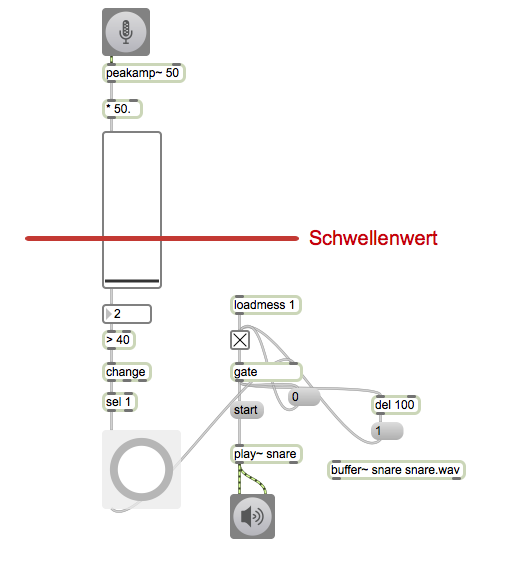
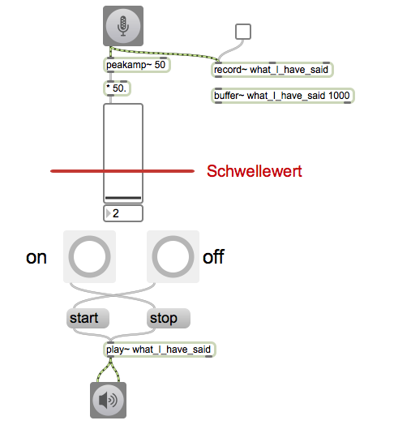
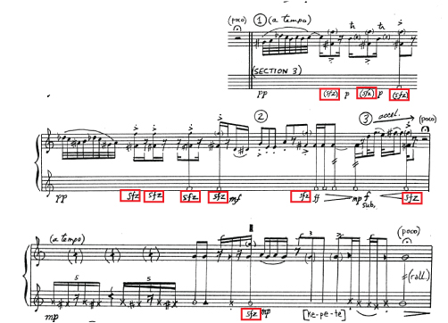
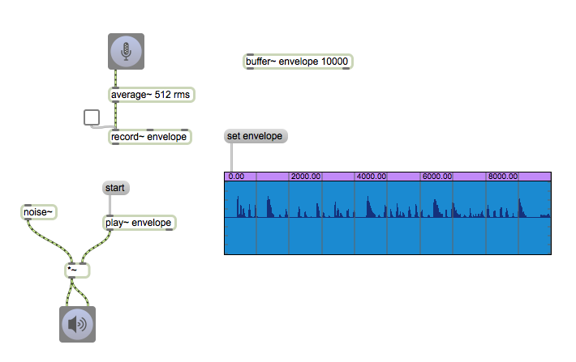
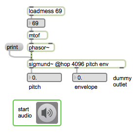

# Klasse1 Laptop als Instrument

## Dateneingänge

- Trackpad
- Tastatur
- Videokamera (iSight)
- Mikrofon

# Track Pad

## mousestate

### Patch1

- X = Frequenz
- Y = Grenzfrequenz eines Filters

### Patch2

- Trackpad-Bewegung stuert die Lautstärke

### Patch3 (Aufgabe)

- Scratching

## Multitouch

[Fingerpinger](http://www.anyma.ch/2009/research/multitouch-external-for-maxmsp/)

### Patch4

- Winkel des Fingers stuert Panning

### Patch5

- After-Touch Effekt

- Was sind semi-major-axis und semi-minor-axis

### Patch6 (Aufgabe)

- Distanz zwischen zwei Fingern stuert Grenzfrequenz
- 

### Patch7

- Winkel zwichen zwei Punkten stuert Frequenz
- 

### Patch8 (Aufgabe)

- Flächeinhalt eines Dreiecks steurt die Lautstärke
- 

# Tastatur

-

### Patch1
-

### Patch2
-

### Patch3
- Sequencer
-

### Patch4

- Sequencer
-

### Virtuoso Musiker mit Tastatur

- [Samchillian](http://en.wikipedia.org/wiki/Samchillian)
- [Demo](http://www.youtube.com/watch?v=lAAhQMU2918)

### Patch5 (Aufgabe)

- relative Tastatur

# Mikrofon

## peakamp~

### Patch1

### Patch2

### Patch3
- als zwei Befehele

## "Music for flute" von Cort Lippe 

[Ausschnitt .wav](img/Lippe-flute.wav)

## bonk~
[bonk~](http://crca-archive.ucsd.edu/~tapel/software.html)

### Patch4

- mapping Lautstärke - Lautstärke

### Patch5
- mapping Lautstärke - Frequenz

### Idee

[Maurizio Kagel - Translation - Roatation](http://noteyobservations.blogspot.de/2012/10/mauricio-kagel-rotation.html)

## sigmund~

[Max/MSP External](http://crca-archive.ucsd.edu/~tapel/software.html)

### Patch6

## Andere Objekte

### zerox~
- nützlich Ton und Geräusch zu unterschieden

### edge~
- zero to non-zero / non-zero to zero transition

### rampsmooth~ / slide~
- um wicher Hülkurve zu erzeugen

## Wietere Entwicklung 

[Mogees](http://www.brunozamborlin.com/mogees/)

## Musik mit Laptop

[Website](http://slork.stanford.edu)
