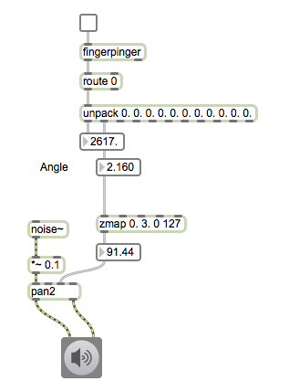
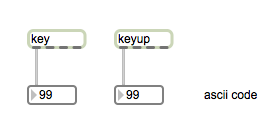

# Klasse1 Laptop als Instrument

## Dateneingänge eines Laptops

- Trackpad
- Tastatur
- Videokamera (iSight)
- Mikrofon

# Track Pad

## mousestate

### Patch1

- X = Frequenz
- Y = Grenzfrequenz eines Filters

### Patch2

- Fingerbewegung stuert die Lautstärke

### Patch3 (Aufgabe)

- DJ-Scratching

## Multitouch

- Website von [Fingerpinger](http://www.anyma.ch/2009/research/multitouch-external-for-maxmsp/)

Mit Fingerpinger kann man folgende Fingerdaten auf dem Trackpad bekommen. 

- Frame
- Angle
- Semi-Major-Axis
- Semi-Minor-Axis
- Xpos
- Ypos
- VelocityX
- VelocityY
- Identifier
- State
- Size

- Was sind semi-major-axis und semi-minor-axis

### Patch4

- Winkel eines Fingers stuert Panning

### Patch5

- After-Touch Effekt

### Patch6 (Aufgabe)

- Distanz zwischen zwei Fingern stuert Grenzfrequenz

### Patch7

- Winkel zwichen zwei Punkten stuert Frequenz

### Patch8 (Aufgabe)

- Flächeinhalt eines Dreiecks steurt die Lautstärke

---

# Tastatur

### Patch1

- Asciicode als Tonhöhe

### Patch2

- Tastatur als MIDI-Tastatur

### Patch3

- Coll vereinfacht "Übersätzung"

### Patch4

- Sequencer
 

### Virtuosomusiker mit Tastatur

- [Samchillian](http://en.wikipedia.org/wiki/Samchillian)
- [Demo](http://www.youtube.com/watch?v=lAAhQMU2918)

### Patch5 (Aufgabe)

- Programm Samchillian!!

