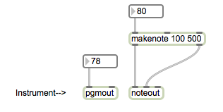
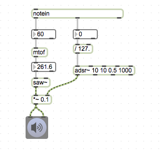

## MIDI

Was ist MIDI?

- MIDI = Musical Instrument Digital Interface
- Protokoll

[MIDI Manufacturer Association](http://www.midi.org) 
[History of MIDI](http://www.midi.org/aboutmidi/tut_history.php)

- serial (nicht parallel)
- sehr alt (seit 1981 / 32 Jahre Alt!!)
- sehr langsam ( 31250 bps = 3907 bytes = max. 1302 MIDI messages pro Sekunde)
	- USB 2.0 ...  480 mbps =  4800000000 bps
	- USB 3.0 ... 5120 mbps = 51200000000 bps 
---
MIDI Kable

- [Making your own MIDI cables](http://www.colomar.com/Shavano/midi_cable.html)

---

MIDI Message besteht aus 3 Bytes.

- Status Byte - Data Byte1 - Data Byte2

Status Byte ist immer gleich oder großer als 128
und Data Bytes sind immer weniger als 128

- [Table of MIDI Message](http://www.midi.org/techspecs/midimessages.php)

---
### Patch 1

Alle musikalische Daten in MIDI sind tatsächlich 3 Zahlen!

---
### Patch 2

Drei Zahlen an midiout shicken.

---
### Patch 3

Wir können auch drei Zahlen schreiben und an "midiout" schicken.

---
### Patch 4

MIDI Objekt füe Menschen

---
### Patch 5

"makenote" erzeugt note on/note off messages 

---
### Patch 6

- Geige = 41
- Shakuhachi = 78
- Gun Shot = 128

[Liste der Instrumenten](http://de.wikipedia.org/wiki/General_MIDI)

---
### Patch 7

Zwei Instrumente gleichzeitig benutzen

---
### Patch 8 (Quiz)

Split Keyboard

Alle töne höher als C1 = Geige, tiefer als C1 = Klavier

---
### Patch 9

"detonate" ist ein MIDI Sequencer in Max

[Kostenlose MIDI Datei](http://www.piano-e-competition.com/midi_2011.asp)

---
### Patch 10

Transposition mit MIDI-Keyboard

---
### Patch 11

MIDI Aufnahme

---

Tim Exile (MIDI Interface Virtuoso)

[Youtube Demo](http://www.youtube.com/watch?v=9r38r3BIgew)
[Finger](http://www.youtube.com/watch?v=wrj6pkQloJM&list=RD4N4P7v-iJRk)

---
### Patch 12

Arpegiator

---

### Patch 13

stripnote ignoriert note off message

---
### Patch 14 (Quiz)

wenn man die c1 Taste drückt , wird das aufgenommene Sample wiedegegeben.

### Patch 15 (Quiz)

1. nimm deine Stimme (c1) auf.
2. mit MIDI Keyboard das aufgenommene Sample wiedergeben. Die tonhöhe des wiedergegebenen Samples muss die Tonhöhe von der Taste sein.

---
### Patch 16

- mtof ... MIDI note number to frequency
- ftom ... frequency to MIDI note number

---
### Patch 17

- velocity steuert die Lautstärke

---
### Patch 18 (Quiz)

- weicherer Anfang und weichere Endung

---
### Patch 19

- adsr~

---
### Patch 20

- typische SynthPad

---
### Patch 21

- kslider / Polyphonic mode

---
### Patch 22

- polyphonic synthesizer

