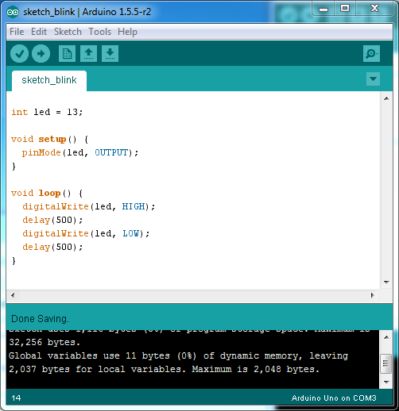

# Klasse 3

## Arduino

### Steckplatine/Breadboard
[Steckplatine wiki](http://de.wikipedia.org/wiki/Steckplatine)

### Sketch1

- blinkende LED

#### mit einer externen LED

### Sketch2

### Sketch3

- langsamer

### Sketch4

- langsamer und schneller

### Sketch5

- randomisierten Intervalle

### Sketch6

- Serial.println

- tools -> Serial Monitor

### Sketch7

- random + serial monitor

- serial monitor

### Sketch8

- einfache Kalkulation in Arduino

### Sketch9

- Schalter und Serial

### Sketch10

- "serial" Objekt in Max

- max patch

### Sketch11

- Aufgabe: Programmieren Sie das folgende System mit einem Arduino, einer LED und einem Schalter. 

---

1. Wenn der Schlater ein ist, blinkt die LED aller 0,2 Sekunden.
2. Wenn der schalter aus ist, blinkt die LED gar nicht.
---

### Sketch12

- Max steuert die LED

- max patch

### Sketch13

- das Blinken als Klang 

---
## Mikrokontroller Musiker

[Tristan Perich 1-bit- Symphony](http://www.1bitsymphony.com)

[Arduino Synth](http://playground.arduino.cc/Main/ArduinoSynth#.UyrtjN6h_JE)

[Mozzi sound synthesis library for Arduino](http://sensorium.github.io/Mozzi/)

