# Klasse 4

## Arduino

### ADC = Analog to Digital Converter

- Arduino Uno hat 6x 10bit ADCs 
- Auflösung 10 bit = 0 - 1023
- 0 ... 0 Volt, 512 ... 2.5 Volt, 1023 ... 5 Volt
- A0 - A5 ... Analog In

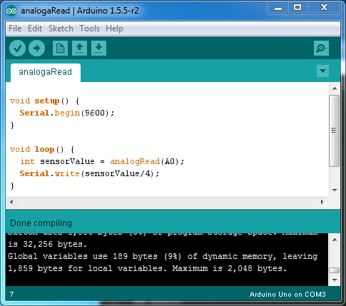

- Serial.write kann nur ein Byte (8bit) auf einmal übertragen, deshalb muss man mit /4 skalieren.

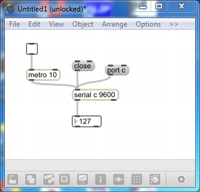

---

### Sketch1

#### voltage divider

- [voltage divider wiki](http://de.wikipedia.org/wiki/Spannungsteiler)

	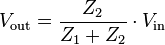  

- voltage divider 2x 220 Ohm

  

	Z1 = 220  
	Z2 = 220  
	220/(220+220) = 0.5  
	0.5 * 255 = ca' 127  

---

### Sketch2

- voltage divider 220 Ohm und 68 Ohm

  

	Z1 = 220  
	Z2 = 68  
	68/(220+68) = 0.2361  
	0.2361 * 255 = ca' 60  

---

### Sketch3

- 68 Ohm --> 220 Ohm  

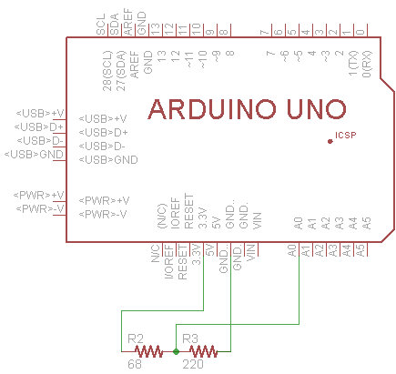  

	Z1 = 68  
	Z2 = 220  
	220/(220+68) = 0.7638  
	0.2361 * 255 = ca' 195 

---

### Sketch4

- potentiometer

Potentiometer ist ein Art von Voltage-Divider
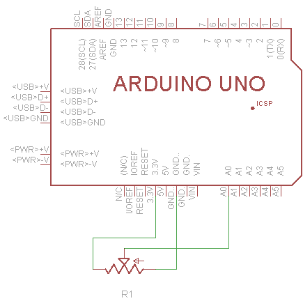

---

### Sketch5

- Force Sensitive Register(FSR)
- Bendsensor
- Lichtsensor

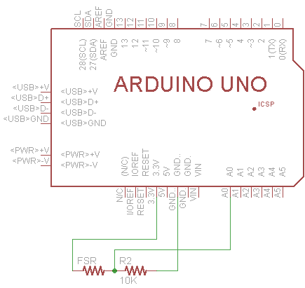

---

### Sketch6
- Infrarotsensor

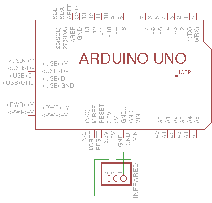

---

### Sketch7

Aufgabe: Erzeugen Sie einen Ton (Viereck) von Arudion mit einem Lautsprecher und steuern Sie die Frequenz des Tons mit
einem FSR, Lichtsensor, oder Bendsensor.

---

Software für Schaltplan 

- [CadSoft Eagle](http://www.cadsoftusa.com/download-eagle/?language=en)

---

### LCD

#### Serial Enabled LCD

- braucht weniger Pins
- langsamer
- teuerer

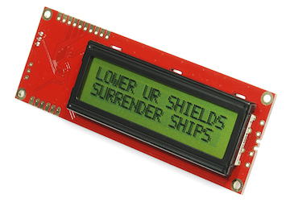

#### 16x 2 LCD

- braucht mindensten 7 Pins
- schneller
- billiger

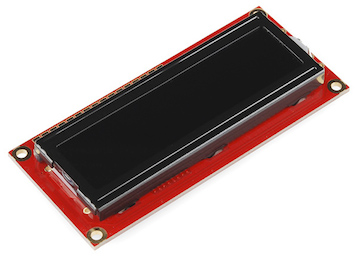

---

### Sketch8

- Sensor + Serial Enabled LCD

[Anweisung](https://github.com/jimblom/Serial-LCD-Kit/wiki/Serial-Enabled-LCD-Kit-Datasheet)

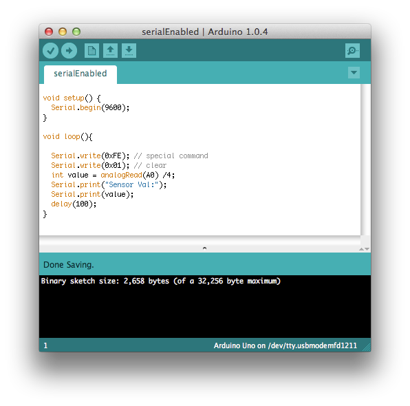

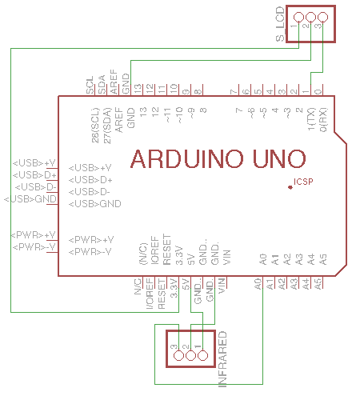
---

### Sketch9

- Sensor +  normare LCD

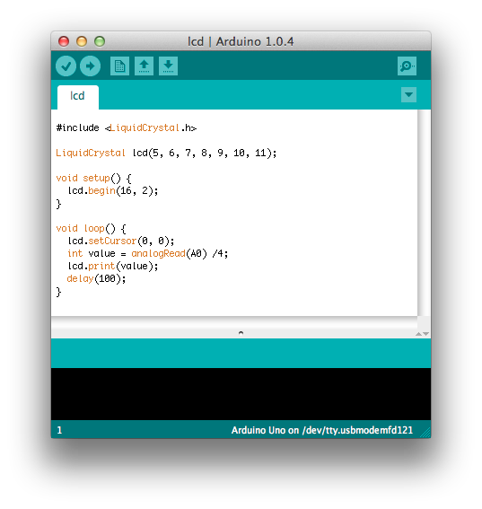

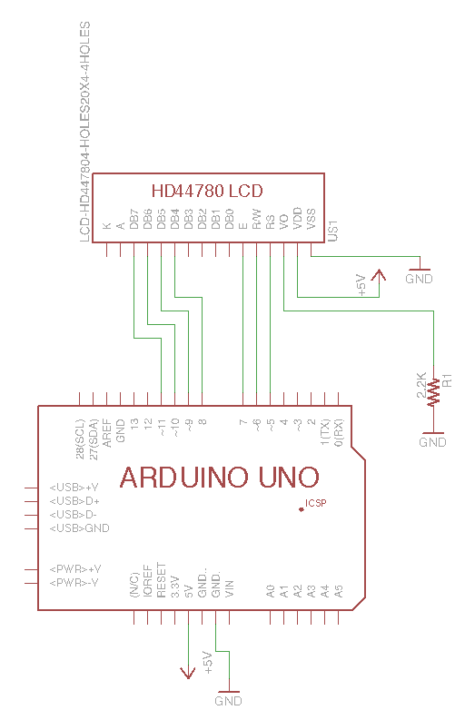

