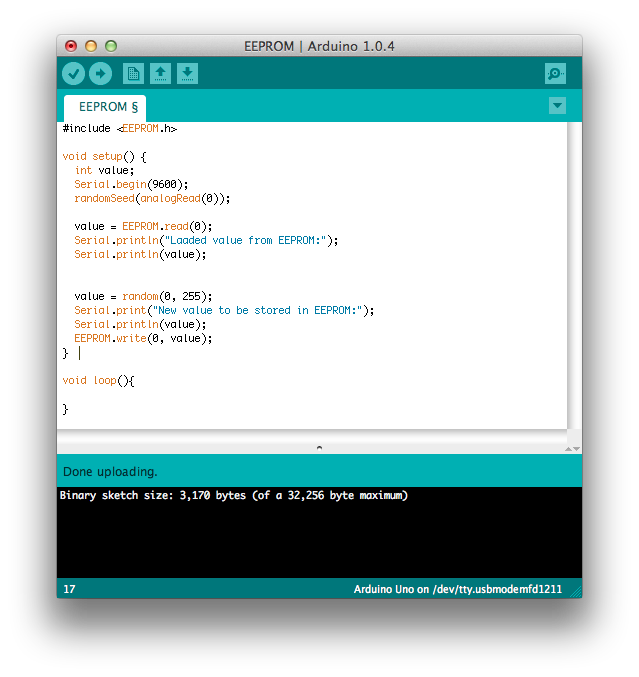

# Klasse 5

Alle Functionen von Arduino
- [Arduino Language Reference](http://arduino.cc/en/Reference/HomePage)

## Interrupt und Arduino

### Sketch 1

-  Tonhöhe-Randomisierung mit einem Knopf (ohne Interrupt)

### Sketch 2

- einmalige Aktualisierung

### Sketch 3

- mit Hardware Interrupt

## Arduino und Timer

ATMega168/328 hat "3 Hardware Timers". Diese Timers funktionieren unabhängig von dem Program und triggern entsprechende Interrupts.

- [Timer1 Website / Download](http://playground.arduino.cc/Code/Timer1)

### Sketch 4

- Blinkende LED mit Timer

### Sketch 5

- Ton mit Timer

### Sketch 6

- Array und Timer

### Sketch 7

- tone() Funktion

### Sketch 8

- mit notone() Funktion

## PWM (Pulse Wave Modulation)

-[PWM wiki](http://de.wikipedia.org/wiki/Pulsweitenmodulation)
-[Arduino PWM](http://arduino.cc/en/Tutorial/PWM)

### Sketch 9

- als Hellichkeit

### Sketch 10

- Dimmen

### Sketch 11

- AnalogRead und AnalogWrite

## EEPROM und Arduino

EEPROM (Electrically Erasable Programmable Read-Only Memory )

ist eine kleine Festplatte auf dem Arduino. Die Daten auf EEPROM wird nicht verloren, wenn man den Arduino ausschaltet. Die Größe von EEPROM auf Arduino Uno lautet 1024 Bytes (=1KB sehr klein! ).

- Man kann nicht mehr als 100,000 EEPROM überschreiben.

## Sketch 12

- Beispiel mit eeprom

## Arduino und SPI 

SPI - Serial Periferal Interface

SPI ermöglicht einen Arduino mit anderen ICs (z.B ADC) zu kommunizieren.

Man kann auch mehrere SPI mit einem Arduino verbinden.

#### SPI Verbindung mit einem externen ADC 

MicroCHIP MCP 3208 ADC

- [Datasheet](http://ww1.microchip.com/downloads/en/DeviceDoc/21298e.pdf)

### Sketch 13

- SPI Verbindung mit mcp3208 ADC

- Stromkreis

