# Klasse6

- Kabelose Lösungen - Video, Kinect, Leapmotion und Xbee

## Jitter für Anfänger

- [download](patch/jitter_patches.zip)

## Video Erkennung mit Jitter

### Patch1 

- Videoaufnahme

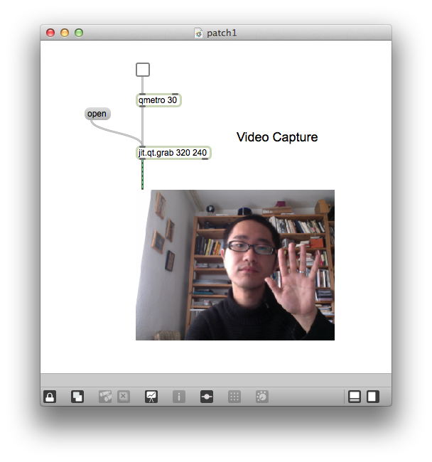

### Patch2

- Videoaufnahme / Wiedergabe
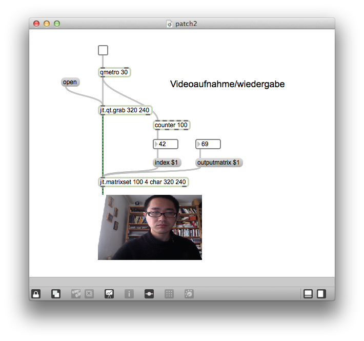

### Patch3

- Untershied
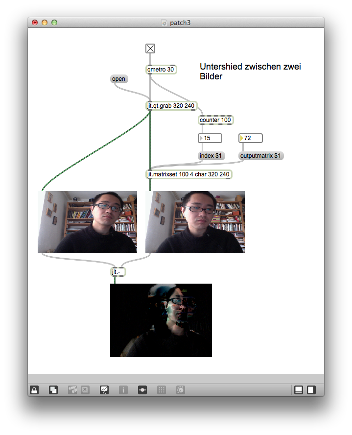

### Patch4

- Untershied als Zahlen
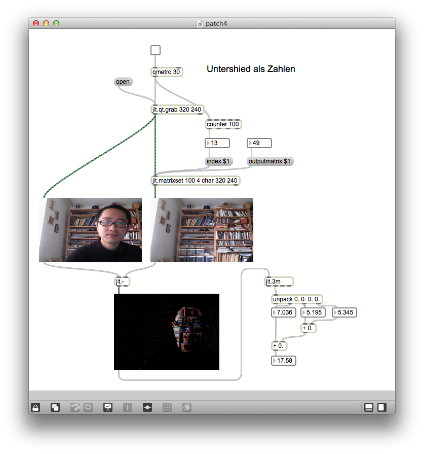

### Patch5

- Bewegungserkennung
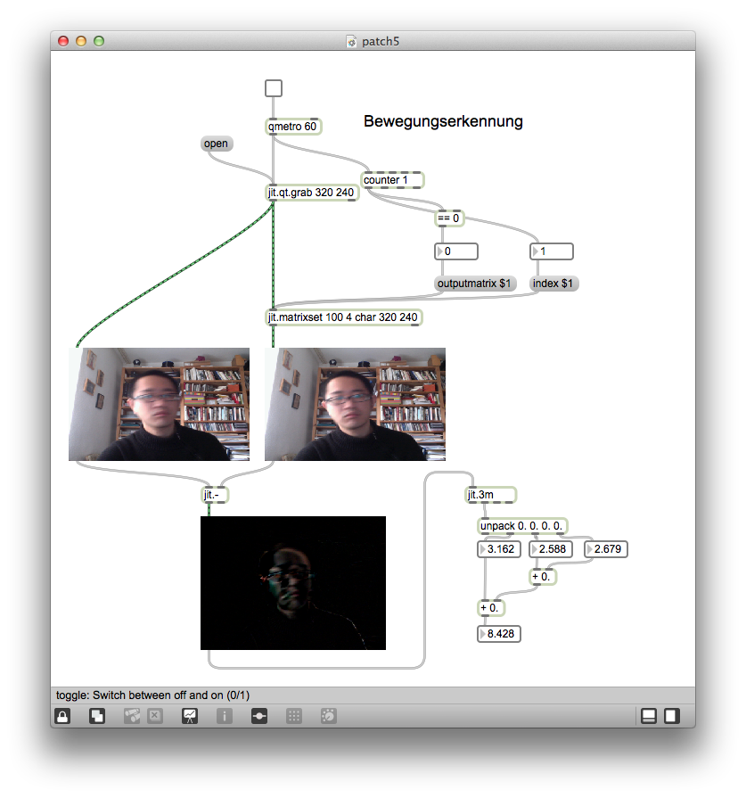

---
## Kinect

Zwei Kinect-Sensor

- Kinect for XBox (Hacking möglich)
- Kinect for Windows (mit offiziellem SDK , C++ oder C#) 

Kinect for Windows

- [Kinect for Windows](http://www.microsoft.com/en-us/kinectforwindows/)

Vergleich Kinect V1 und V2

- [Kinect v1 und v2](https://www.youtube.com/watch?v=eNIP9nFo9n4)

Kinect for Max/MSP

- [jit.freenect.grab](http://jmpelletier.com/freenect/)

---
## Leap Motion

[Leapmotion](http://www.leapmotion.com)
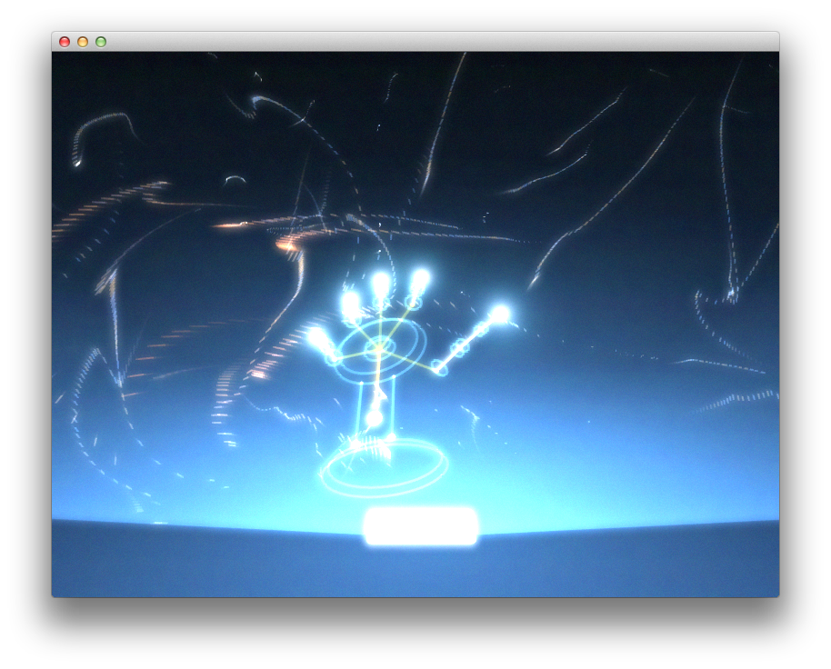

### Laptop mit Leapmotion
[HP Envy](http://www.computerbild.de/artikel/cb-News-Notebooks-HP-Envy-17-Leap-Motion-Laptop-Gestensteuerung-8747145.html)

### Leapmotion für Max 
[aka.leappmotion](http://akamatsu.org/aka/max/objects/)
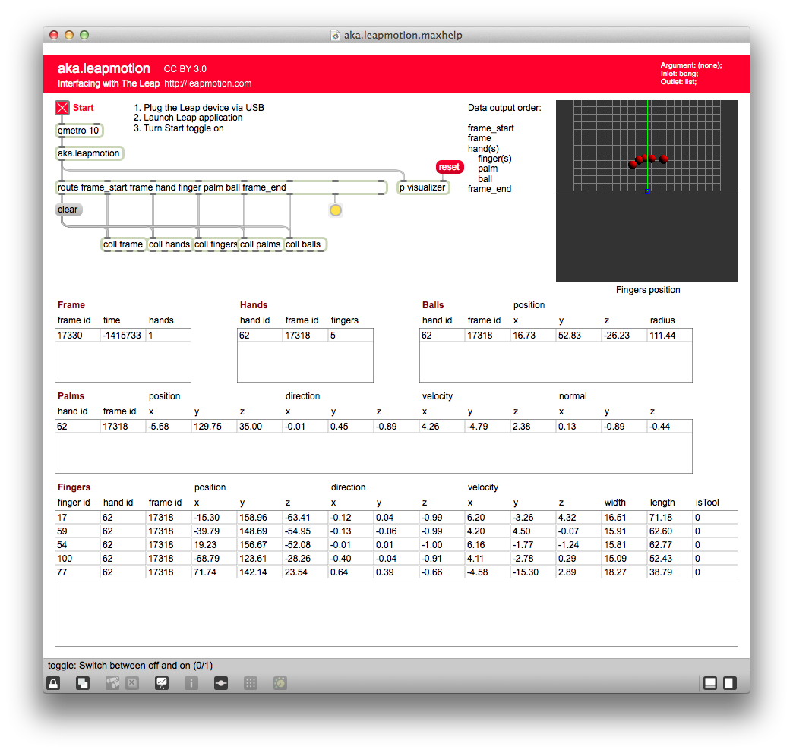

### Leapmotion für OSC
[leapOSC](https://github.com/morphiccreative/leapOSC)
[OSC Motion](https://airspace.leapmotion.com/apps/osc-motion/osx)

---

# Mikrofon

## peakamp~
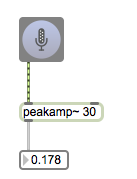

### Patch1

- Klang triggert ein Sample

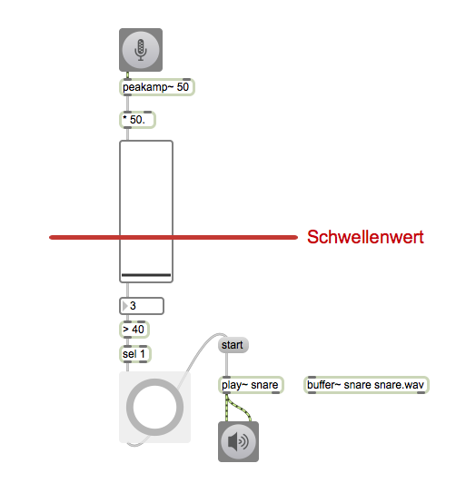

### Patch2

- Klang triggert ein Sample (ohne Wiederholung )

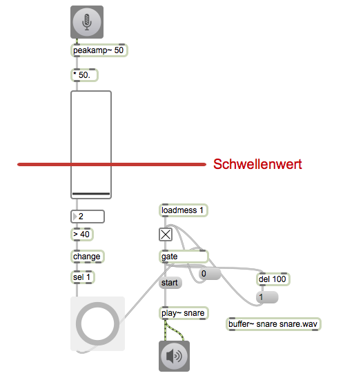

### Patch3

- als zwei Befehele

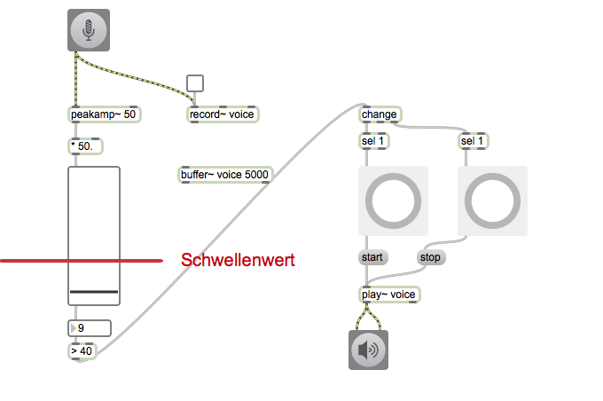

## "Music for flute" von Cort Lippe 

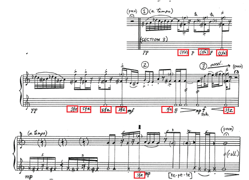

- [Ausschnitt](img/Lippe-flute.wav)

### Patch4

- mapping Lautstärke - Lautstärke

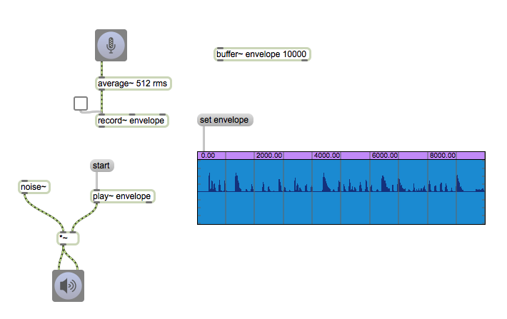

### Patch5
- mapping Lautstärke - Frequenz

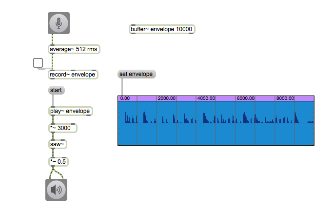

## sigmund~

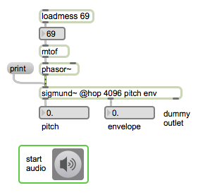

[Max/MSP External](http://crca-archive.ucsd.edu/~tapel/software.html)

### zerox~
- nützlich Ton und Geräusch zu unterschieden

### edge~
- zero to non-zero / non-zero to zero transition

### rampsmooth~ / slide~
- um wicher Hülkurve zu erzeugen

### bonk~
- Attack Detector von M.Puckette

## Mogees

[Mogees](http://www.brunozamborlin.com/mogees/)

